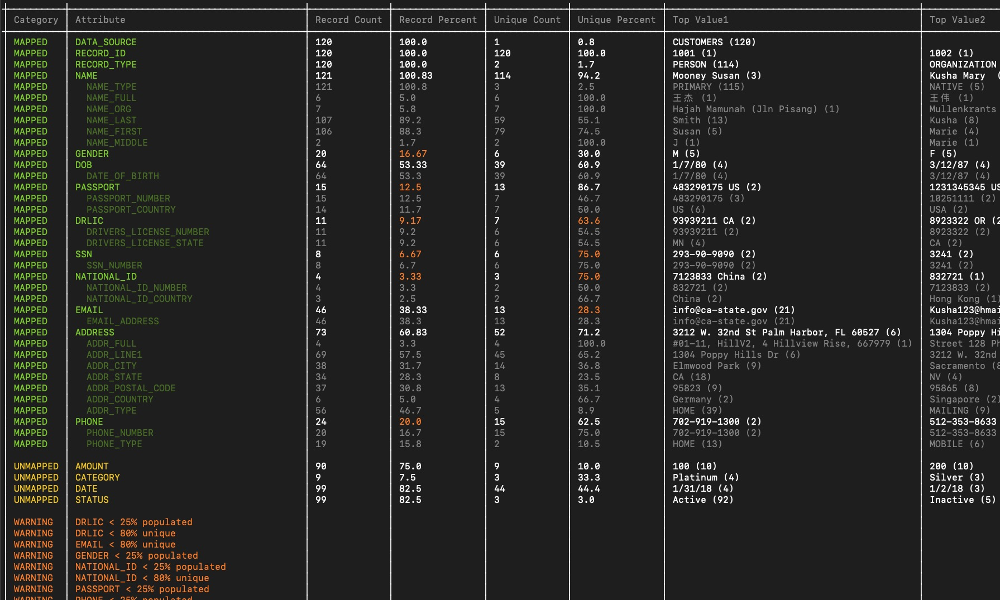

# sz-json-analyzer

## Overview

This is a python utility used to analyze [Senzing mapped JSON data](https://senzing.zendesk.com/hc/en-us/articles/231925448-Generic-Entity-Specification) files before loading into Senzing.

### Prerequisites
- Python 3.6 or higher
- Senzing API version 3.0 or higher
- python pretty table module (pip3 install prettytable)

### Installation

Place the following files in a directory of your choice:  
- [sz_json_analyzer.py](sz_json_analyzer.py)
- [sz_default_config.json](sz_default_config.json)

Note: Ideally, you run this utility with the Senzing environment set to your project so that it picks up the latest configuration.  However, it will use the [sz_default_config.json](sz_default_config.json) if you run it without.

## Usage

```console
usage: sz_json_analyzer.py [-h] [-i INPUT_FILE] [-o OUTPUT_FILE]

optional arguments:
  -h, --help            show this help message and exit
  -i INPUT_FILE, --input_file INPUT_FILE
                        the name of the input file
  -o OUTPUT_FILE, --output_file OUTPUT_FILE
                        optional name of the output file
```

## Sample output



The green "mapped" section shows all the attributes the Senzing config recognized with population and uniqueness percent with the top 10 most used values.

The yellow "unmapped" section shows all the attributes the Senzing config did not recognize. This should only contain any attributes you specifically did not map.

The orange "warning" section shows observations you may not be aware of, such as low population or uniqueness percent of identifiers as well as incomplete features such as addresses without postal codes.

There is also a blue "information" section showing minor observations such as only a few records have incomplete features, but for the most part they are complete.

Finally, there may be a red "error" section which shows reasons your data will not load.  Such as missing data source code and bad json.
